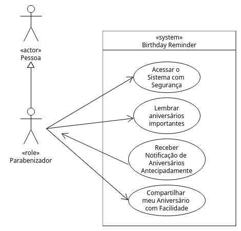
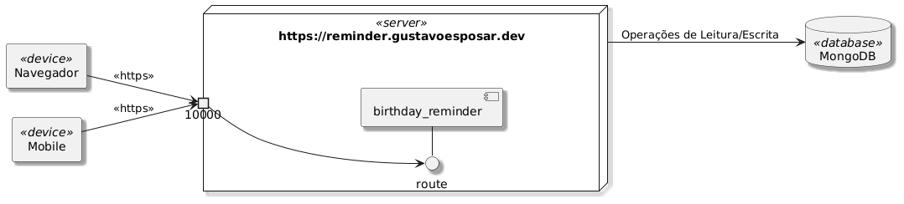
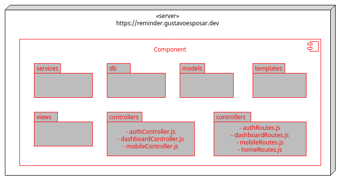
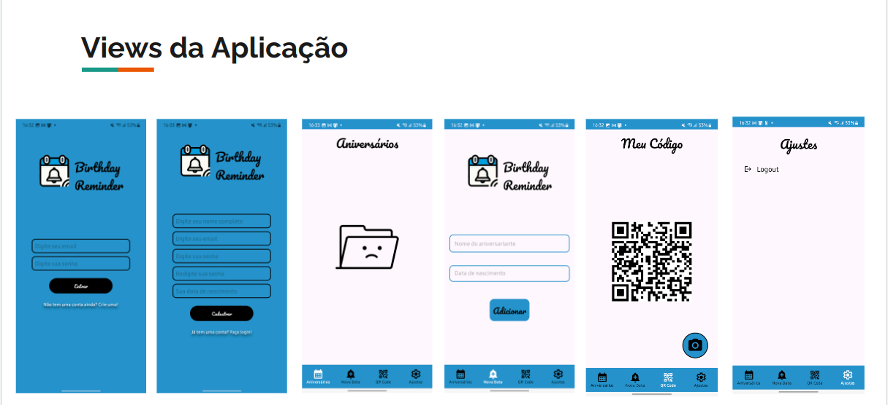

# birthday_reminder

## Tecnologias utilizadas
-  [Render: Cloud Application Hosting for Developers](https://render.com/)
- [MongoDB Atlas M0](https://mongodb.com/)
- [UptimeRobot: Free Website Monitoring Service](https://uptimerobot.com/website-monitoring/)
- HTML
- CSS
- Javascript
- Node.js
    - express-server
    - express-session
    - connect-mongo
    - mongoose
    - nodemailer
    - node-cron
    - nodemon
    - cors
    - jsonwebtoken
- Android Studio (Java)

## Propóstio

Esta aplicação de software é um projeto pessoal, desenvolvido como uma prova de conceito com o intuito de, além de satisfazer uma necessidade pessoal, desenvolver novas habilidades de banco de dados e gestão de servidores em nuvem (deploy), além de novas bibliotecas de linguagem.
O projeto também foi reaproveitado para a disciplina DAM (Desenvolvimento de Aplicações Mobile) na graduação, obtendo por produto a versão Android do Birthday Reminder, tornando-se um **sistema distribuído (Action Based API)** multi-plataforma

## Comportamento

Trata-se de uma aplicação que notifica aniversariantes dentro de intervalos de tempo especificos (no dia, 2 dias antes e 1 semana antes).
Para isso foram especificados email's de destinatário e remetente (Gmail), templates genéricos HTML para cada intervalo de notificação e também popular um banco de dados para disponibilizar os dados nas rotinas de processamento.

O node-cron é o core que possibilita programar os disparos de emails de notificação com base em timezones específicas.
Basicamente todo dia num horario especifico uma rotina é disparada para consultar no banco de dados quais regsitros/documentos, no contexto de cada usuário, possuem data de aniversário nos intervalos especificos e com base na resposta obtida, dispara notificações.

## Caderno de Engenharia (básico)

### Análise de Domínio
A figura a seguir busca comunicar via UML as metas de interação do ator com o sistema. Dessa forma elaboram-se histórias e cenários [(Jacobson, 2016)](https://www.ivarjacobson.com/files/field_iji_file/article/use-case_2.0_final_rev3.pdf) de interação, meio pelo qual identificamos requisitos funcionais que a aplicação deve suportar.

### Arquitetura cliente-servidor

### Arquitetura de Módulos MVC (servidor)

## Interface Mobile (Android)

## Disclaimer

Todos os artefatos utilizados neste projeto estão em conformidade com direitos autorais

A figura a seguir ilustra a notificação recebida pelo destinatário

